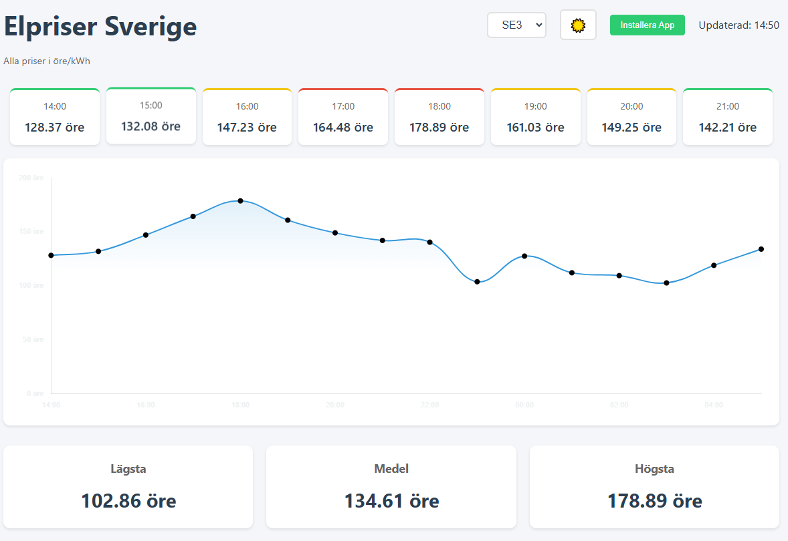
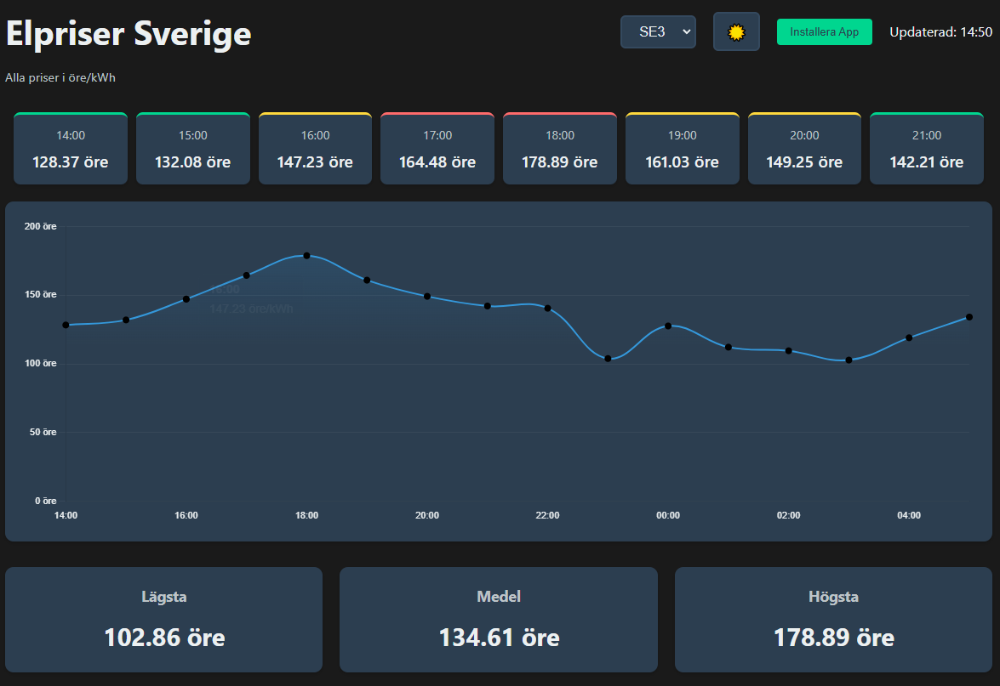

# Electricity Price Tracker

A real-time electricity price tracking Progressive Web Application (PWA) that displays hourly electricity prices for different regions in Sweden. The application shows current and upcoming prices, price statistics, and visual representations of price trends.

## Features

- 🕒 Real-time price updates
- 📊 Visual price representation with interactive charts
- 📱 Progressive Web App (PWA) - installable on mobile devices
- 🌙 Dark/Light theme support with system preference detection
- 🎯 Smart theme persistence across sessions
- 🌑 Smooth midnight transition handling
- 📈 Price statistics (lowest, average, highest)
- 🎨 Color-coded price indicators with theme-aware colors
- 🔄 Advanced data caching with fallback mechanisms
- 🌐 Multiple region support (SE1, SE2, SE3, SE4)
- 📶 Offline capability with service worker
- 🔍 8-hour price forecast display
- 🔒 Secure data handling and CORS support
- 📱 Responsive design for all devices
- ⚡ Optimized performance with minimal DOM updates

## Installation

### As a Web Application

1. Visit [https://elpriset.github.io](https://elpriset.github.io) in your web browser
2. The application will work immediately in your browser
3. The app automatically adapts to your system's theme preference

### As a PWA (Mobile/Desktop)

1. Visit the application URL in a supported browser (Chrome, Edge, Safari)
2. Click the "Install" button in the top right corner
3. The app will install and create an icon on your device
4. Enjoy native app-like experience with offline support

## Usage

1. Select your region from the dropdown menu (SE1-SE4)
2. View current electricity prices and upcoming 8-hour forecast
3. Toggle between light and dark themes using the theme button
4. Check price statistics at the bottom of the page
5. Prices are color-coded (theme-aware):
   - 🟢 Green: Low price
   - 🟡 Yellow: Medium price
   - 🔴 Red: High price

## Technical Details

### API Integration

The application uses the elprisetjustnu.se API with multiple fallback proxies:
- Primary API: `https://elprisetjustnu.se/api/v1/prices`
- Endpoint format: `/{YYYY}/{MM-DD}_SE{N}.json`
- Fallback CORS proxies for reliability

### Data Handling

- Multi-layer caching strategy:
  - Browser cache
  - Service Worker cache
  - Application state cache
- Smart cache invalidation (1-hour TTL)
- Concurrent fetching of today's and tomorrow's prices
- Robust error handling with graceful degradation

### Theme Management

- System theme preference detection
- Theme persistence across:
  - LocalStorage
  - Cookies
  - Service Worker cache
- Smooth theme transitions
- Theme-aware UI components and charts

### Performance Optimizations

- Efficient price data caching
- Memoized price category calculations
- Smart preloading of next hour's data
- Optimized chart rendering with theme support
- Minimal DOM updates
- Responsive image loading
- Service Worker for offline support

## Browser Support

- Chrome (latest)
- Firefox (latest)
- Safari (latest)
- Edge (latest)
- Mobile browsers (iOS Safari, Android Chrome)
- PWA support for installable experience

## Contributing

1. Fork the repository
2. Create your feature branch (`git checkout -b feature/AmazingFeature`)
3. Commit your changes (`git commit -m 'Add some AmazingFeature'`)
4. Push to the branch (`git push origin feature/AmazingFeature`)
5. Open a Pull Request

## License

This project is licensed under the Apache License 2.0 - see the [LICENSE](LICENSE) file for details. 
For third-party attributions, see the [NOTICE](NOTICE) file.

## Acknowledgments

- Data provided by [elprisetjustnu.se](https://elprisetjustnu.se)
- Chart.js for data visualization
- Service Worker for PWA functionality

## Support

For support, please open an issue in the GitHub repository or contact the maintainers.

## Security

This application implements several security measures:
- CORS handling with multiple fallback proxies
- Secure theme and region preference storage
- Multi-layer data caching with validation
- Input sanitization and validation
- Comprehensive error handling
- Secure API integration

For security concerns or vulnerability reports, please contact the maintainers directly. 