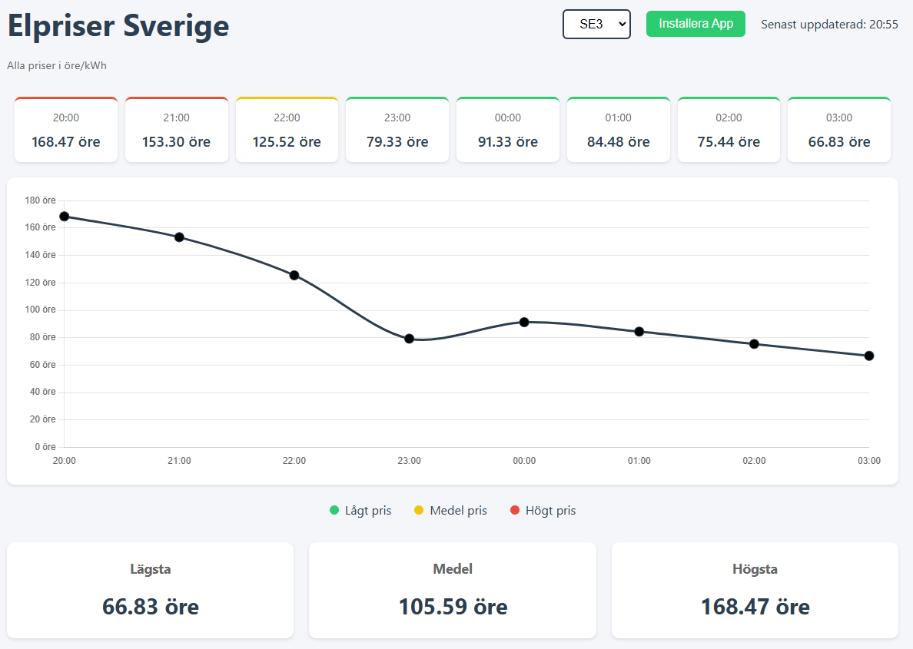

# Electricity Price Tracker

A real-time electricity price tracking Progressive Web Application (PWA) that displays hourly electricity prices for different regions in Sweden. The application shows current and upcoming prices, price statistics, and visual representations of price trends.

## Features

- 🕒 Real-time price updates
- 📊 Visual price representation with interactive charts
- 📱 Progressive Web App (PWA) - installable on mobile devices
- 🌙 Smooth midnight transition handling
- 📈 Price statistics (lowest, average, highest)
- 🎨 Color-coded price indicators
- 🔄 Automatic data caching for improved performance
- 🌐 Multiple region support (SE1, SE2, SE3, SE4)
- 📶 Offline capability
- 🔍 8-hour price forecast display

## Installation

### As a Web Application

1. Visit the application URL in your web browser
2. The application will work immediately in your browser

### As a PWA (Mobile/Desktop)

1. Visit the application URL in a supported browser (Chrome, Edge, Safari)
2. Click the "Install" button when prompted
3. The app will install and create an icon on your device

## Usage

1. Select your region from the dropdown menu (SE1-SE4)
2. View current electricity prices and upcoming 8-hour forecast
3. Check price statistics at the bottom of the page
4. Prices are color-coded:
   - 🟢 Green: Low price
   - 🟡 Yellow: Medium price
   - 🔴 Red: High price

## Technical Details

### API Integration

The application uses the elprisetjustnu.se API:
- Base URL: `https://elprisetjustnu.se/api/v1/prices`
- Endpoint format: `/{YYYY}/{MM-DD}_SE{N}.json`

### Data Handling

- Automatic data caching with 1-hour invalidation
- Concurrent fetching of today's and tomorrow's prices
- Robust error handling and fallback mechanisms

### Performance Optimizations

- Efficient price data caching
- Memoized price category calculations
- Preloading of next hour's data
- Optimized chart rendering
- Minimal DOM updates

## Browser Support

- Chrome (latest)
- Firefox (latest)
- Safari (latest)
- Edge (latest)
- Mobile browsers (iOS Safari, Android Chrome)

## Contributing

1. Fork the repository
2. Create your feature branch (`git checkout -b feature/AmazingFeature`)
3. Commit your changes (`git commit -m 'Add some AmazingFeature'`)
4. Push to the branch (`git push origin feature/AmazingFeature`)
5. Open a Pull Request

## License

This project is licensed under the Apache License 2.0 - see the [LICENSE](LICENSE) file for details.

## Acknowledgments

- Data provided by [elprisetjustnu.se](https://elprisetjustnu.se)
- Chart.js for data visualization
- Service Worker for PWA functionality

## Support

For support, please open an issue in the GitHub repository or contact the maintainers.

## Security

This application implements several security measures:
- CORS handling
- API fallback mechanisms
- Secure data caching
- Input validation
- Error handling

For security concerns or vulnerability reports, please contact the maintainers directly. 